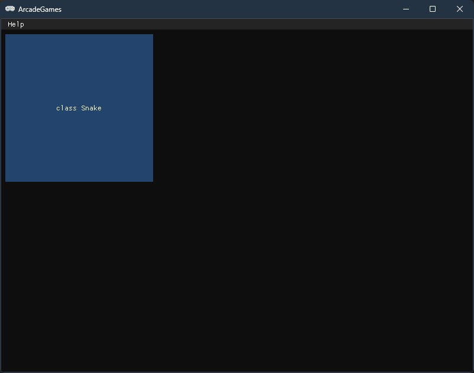
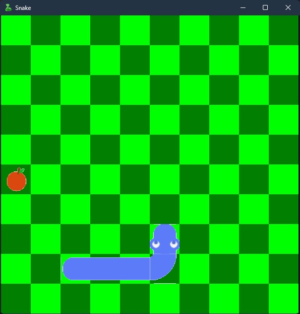

# ArcadeGames
This is a small launcher, while developing which I am learning to work with Opengl, Openal and other libraries.
Available games: [Snake](#snake)


## Cloning and compiling
To clone this repository use 
```
git clone https://github.com/MaserPlay/ArcadeGamesGlfw.git
git submodule init
git submodule update
```
In Windows use [vcpkg](https://vcpkg.io/) to install related libraries

See https://vcpkg.io/ for vcpkg install && initialisation.

Than install related libraries with following command:
```
vcpkg install opengl
vcpkg install opengl-registry
vcpkg install glew
vcpkg install glm
vcpkg install glfw3
vcpkg install imgui
vcpkg install openal
vcpkg install sndfile
vcpkg install stb
vcpkg install libzip
vcpkg install spdlog
```
## Future
In future I want to
- [ ] reduce the number of linked libraries ,
- [ ] create a multi-window ,

 and release following games:
- [X] Snake (reference - https://g.co/kgs/cS4VW9D) ,
- [ ] Pacman (reference - https://masonicgit.github.io/pacman/ , https://www.google.com/logos/2010/pacman10-i.html)
# Games
### Snake
This is first game, that I release.



Controlling:

<kbd>W</kbd><kbd>A</kbd><kbd>S</kbd><kbd>D</kbd> - Movement

<kbd>I</kbd> - Info, about game

<kbd>O</kbd> - Open map

<kbd>Esc</kbd> - Exit game

#### Future
I want to
- [ ] create animation to snake
- [X] Add a counter
- [ ] Redraw all assets
